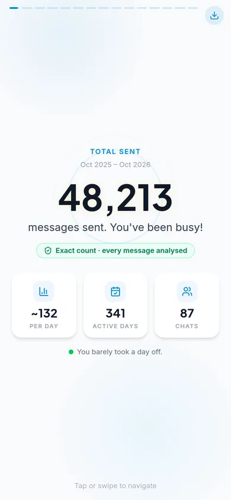

# Telegram Wrapped

A "Spotify Wrapped" for Telegram: log in with your phone number and get a swipeable deck of your year in messages — how much you sent, who you talk to most, when you text, how fast you reply, your phrases, stickers, texter type and more.

Try the UI without Telegram: run the frontend and open `/?demo=1`.

<p>




</p>

## Quick start

```bash
./dev.sh    # installs everything, asks for your API ID/hash once, starts both servers
```

Then open http://localhost:5173 and log in whenever you're ready (or `/?demo=1` for the demo deck). Needs Python 3.10+ and Node 18+; API credentials come from https://my.telegram.org.

## Manual setup (development)

```bash
cp .env.example backend/.env          # fill in TELEGRAM_API_ID / TELEGRAM_API_HASH
cd backend && pip install -r requirements-dev.txt && uvicorn app.main:app --reload
cd frontend && npm install && npm run dev   # http://localhost:5173
```

Tests: `cd backend && pytest` · Lint/build: `cd frontend && npm run lint && npm run build`

## How it stays fast without hitting rate limits

Telegram throttles clients with `FLOOD_WAIT` errors. Instead of trying to dodge the limits (which gets accounts restricted), the pipeline **needs far fewer requests**:

| | Before | Now |
|---|---|---|
| What is read | Both sides of every chat, random samples | Only **your** messages: `messages.search(from_id=self, min_date, max_date)` |
| Message totals | Sum of both sides (double counted) | Telegram's **exact** per-chat count of what you sent |
| Media totals | Lifetime, both sides | What you sent this year |
| Group chats | Supergroups skipped | Supergroups included (bots, channels, Saved Messages excluded) |
| Concurrency | Fixed 3 + fixed sleeps | Adaptive (AIMD): grows while healthy, halves on `FLOOD_WAIT`, one shared pause |
| Slow accounts | Could stall for minutes | Soft deadline: degrades to stratified estimates, never hangs |
| Takeout | Waited up to 8 min for approval | Used when instantly available, otherwise standard API right away |

1. **Count**: one search per chat returns the exact number of messages you sent there *and* the newest 100 of them. Most chats are done after this single call.
2. **Read**: if everything fits the page budget (default 60k messages), every message you sent is read: **exact mode**. Otherwise each chat is split into up to 52 time windows; each window reports its exact size, so every sampled message carries a weight `window_count / fetched`. This is a stratified estimator, so totals stay exact and distributions are unbiased (**estimated mode**).
3. **Conversations**: a few contiguous both-sides windows in your top 1:1 chats give reply speed and who starts conversations.

In a busy group you might write 2% of the messages, so paging through history wastes 98% of calls. Reading only your messages lets most accounts get *exact* stats in a few hundred calls. Every result carries an `accuracy` block (mode, coverage %, messages analysed, API calls, duration) that the UI shows.

Verify against your own account: `cd backend && python -m scripts.live_check --verify 3`.

## Scaling

```
browser ── nginx ──┬── api replica 1 ─┐
                   ├── api replica 2 ─┼── Redis (sessions, progress, results, rate limits)
                   └── api replica N ─┘
                         bot (single poller, optional)
```

- **Stateless API**: with `REDIS_URL` set, sessions, progress, results, rate limits and the bot mapping live in Redis, so any request can hit any replica or worker. With no Redis, an in-memory store keeps local development simple.
- **No session files**: Telethon `StringSession`s are encrypted with Fernet (`SESSION_ENCRYPTION_KEY`) before they reach the store.
- **Bounded work per instance**: `MAX_CONCURRENT_PIPELINES` (default 8). Further users queue, and the UI shows their position live. CPU-heavy statistics run in a process pool (`STATS_WORKERS`) so streaming endpoints stay responsive.
- **Bounded memory**: messages become compact records immediately, and text analysis subsamples above 25k messages. A 168k-message account computes in ~2 s.
- **Privacy by default**: the Telegram authorization is revoked (`log_out`) as soon as a Wrapped is generated. Unused logins are revoked by an expiry sweeper (claimed atomically across replicas). Results expire after `RESULT_TTL`.

```bash
cp .env.example backend/.env   # + SESSION_ENCRYPTION_KEY
docker compose up --build --scale api=3            # http://localhost:8080
docker compose --profile bot up -d bot             # optional notification bot
```

Load test (single instance, 80 ms simulated Telegram latency, 40 simultaneous users): all done in ~36 s, ~6 s per pipeline, ~300 API calls per user, `/health` p50 4 ms.

See `.env.example` for every tunable.
